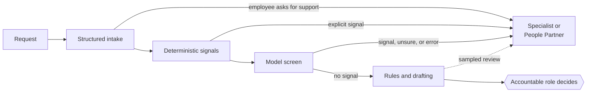

# Work redesign: the People Partner who handles employee requests

> **01 / DECIDE** · A task-level redesign of one HR role, tested against working code.

[← Use case library](README.md) · [Playbook home](../README.md) · [Resolve, the working prototype](https://github.com/ellehelvig/peopleops-resolution-agent)

---

Request wording is not request intent. "Can I work from home two days a week?" is correctly labeled a remote-work request. If the next sentence mentions chemotherapy, the label is still correct, but the right process, the risk, who should see the request, what may be disclosed, and what can safely be automated have all changed.

**Classification is not merely a language problem. It is a workflow, risk, and accountability problem.**

This page redesigns one HR role around that idea, task by task, and tests the design against a working prototype. Here, HRBP means the HR partner aligned to a business leader; People Partner means the HR professional who owns employee requests in a tiered service. Organizations use both titles for both scopes.

## Decisions

1. **Zero tasks currently meet the evidence threshold for end-to-end model autonomy.** Autonomy is a design decision earned through evidence, not a milestone every workflow is expected to reach.
2. Layered risk screening and routing comes before any automation. No single classifier decides whether an employee's request reaches the right people.
3. Rules wherever the data supports them. Where policy data is not governed well enough for rules, the constraint is information architecture, not model capability.
4. The People Partner's work moves from retrieving and drafting toward judgment, exceptions, and improving the system, and People Partners help design that change.

| Mode | Meaning | Tasks |
|---|---|---|
| Automate with rules | Ordinary software; no model | 2, 3\*, 9, 10a |
| Automate with a model | A model acts with no person deciding | None currently |
| Augment | A model drafts; a person edits and owns the result | 4 |
| Assist | A model informs or recommends; a person decides | 1, 3\*, 5, 6, 10b |
| Human-led | No model on the substance; software may detect, route, and prepare | 7, 8 |

\*Task 3 is rules when policy data is governed, and assisted retrieval with human verification when it is not.

## Method

1. Break the case-handling part of the role into tasks. *Done, from the workflow Resolve implements and practitioner judgment. Not yet grounded against O\*NET.*
2. Classify each task with the [decision sequence](#decision-sequence). *Done.*
3. Test the classifications against Resolve, including held-out cases and probes. *Done for what Resolve implements.*
4. Validate with People Partners: task decomposition, exceptions and invisible work, realistic failure scenarios, workflow tests, unintended consequences, workload changes, and improvement after deployment. *Not yet done.*

Status in this document uses five terms. **Observed:** seen in a test or probe. **Proposed:** designed, not built. **Implemented:** built, with no test. **Tested:** built, and a named test checks it. **Validated:** shown to work with real users and data. Nothing here is validated.

## Task map

| # | Task | Mode | Accountable role | If wrong | Reversible? | Status |
|---|---|---|---|---|---|---|
| 1 | Screen and route each request | Layered | HR service delivery (operation); specialist teams (criteria) | Critical | Misses: no | Proposed. Keyword layer tested; failures observed |
| 2 | Check eligibility thresholds | Rules | Policy owner | High | Yes, if never sent as a denial | Tested |
| 3 | Select the policy in force | Rules or verify | Policy owner | High | Before sending | Tested on governed data |
| 4 | Draft the reply | Augment | People Partner | Medium | Until sent | Proposed; templates today |
| 5 | Organize options across policies | Assist, constrained | People Partner or specialist | High | Often no | Proposed |
| 6 | Prepare a consequential decision | Assist | Set by decision type | High | Hard once acted on | Approval gate tested |
| 7 | Handle a workplace concern | Human-led | Employee Relations | Critical | No | Routing of known phrasing tested |
| 8 | Handle a health or accommodation need | Human-led | Accommodations specialist | Critical | Disclosure: no | Proposed. Failure observed |
| 9 | Keep case records and logs | Rules | HR operations | High | Exposure: no | Tested, in-memory prototype |
| 10 | Report on cases | 10a rules; 10b assist | Policy owner or People Analytics | Medium | Re-identification: no | Proposed |

Tasks 1, 7, and 8 carry the most risk and have the least evidence. Task-by-task reasoning is in [task detail](#task-detail).

## The hidden-risk pattern

Resolve routes requests with keyword rules. It passes all 60 baseline cases, which were written alongside those rules, and none of 16 held-out cases written afterwards. None of the 5 held-out Employee Relations or legal concerns was escalated: four received a generic "which topic?" reply, and a planned labor-board complaint entered the routine relocation workflow ([method and results](https://github.com/ellehelvig/peopleops-resolution-agent/blob/main/docs/evaluation-methodology.md#held-out-cases)). Five cases show that the failure occurs, not how often.

A single probe shows why it matters. "I need to work from home on Tuesdays and Thursdays during my chemotherapy" was recognized as remote work and sent to the employee's manager and People Partner, with no flag ([reproduce](#reproducing-the-probe)). The system was not wrong about the topic. It missed context that should have changed the workflow, the handling of health information, the oversight, and who decides.

Adding "chemotherapy" to a keyword list would pass the probe and miss "my treatment schedule." The class of failure needs a structural answer: look for signals that change which process applies, including health, disability, accommodation, protected leave, workplace concerns, retaliation, safety, and legal action, before any downstream automation.



The design is layered because each layer fails differently. Structured intake gives employees an explicit path, but people often do not know their situation is an accommodation, protected leave, or retaliation matter. Deterministic signals catch explicit terms and nothing else. A model may recognize context described in ordinary words, which is the hypothesis to test, but a probabilistic classifier should never be the only safeguard between an employee and the right process. Any layer can send a request to a person. None can clear one alone. If the screen errors or is unavailable, everything goes to a person. HR service delivery operates the routing; Employee Relations, accommodations, leave, Legal, and Privacy set its criteria; the People Partner or specialist owns each case after routing.

The screen returns a route, never a diagnosis or quoted text: it detects enough to route safely, not enough to expose. A manager learns what their role requires, such as an approved schedule, and not the reason. Harmful misses and unnecessary escalations are both measured, because optimizing one without the other shifts the cost to employees or to specialists.

**The evidence proves the problem, not yet the solution.** Layered screening is a design hypothesis until it is built and evaluated. Until then, Resolve's [risk register](https://github.com/ellehelvig/peopleops-resolution-agent/blob/main/docs/governance-and-risk.md) keeps residual risk for missed Employee Relations and legal concerns at High.

## Decision sequence

The same eight questions, in this order, produced every classification. Screening comes before the rules question because a correct rule applied to the wrong process still produces the wrong outcome.

1. Could this request contain a signal that changes how it must be handled?
2. If yes or uncertain, route it before downstream automation.
3. Can a deterministic rule reliably perform the remaining task, given the quality of the underlying data?
4. If yes, use the rule.
5. If not, should AI augment, assist, or stay out?
6. What happens if it is wrong, and how reversible is the consequence?
7. Which role is accountable for the outcome?
8. What evidence would demonstrate that the design works?

A task earns more autonomy only when question 8 has an answer backed by evidence.

## How the work changes

*Practitioner judgment, not yet validated with People Partners.*

| Less central as routine execution changes | More important |
|---|---|
| Looking up policy text and thresholds | Knowing when the apparent request is not the real issue |
| Writing routine replies from scratch | Reviewing ambiguous routing and recognizing misclassification |
| Categorizing every request by hand | Identifying new failure patterns and improving routing criteria |
| Re-keying case details | Handling exceptions, and judging which options fit a person |
| Reading every case to find trends | Writing a decision rationale someone else can follow |

| New, AI-related | Enduring, and more valuable |
|---|---|
| Verifying generated claims against the source | Discretion with sensitive disclosures |
| Recognizing automation bias in one's own reviews | Hearing the need behind a request |
| Turning a miss into an evaluation case | Judgment in Employee Relations and accommodation matters |
| Understanding what the system can and cannot catch | Accountability for outcomes |
| Recognizing when information quality is too poor for automation | Explaining decisions to employees and managers |

## How success is measured

Measure changed work, not launched tools.

| Measure | Tasks |
|---|---|
| Harmful misses, from a monthly Employee Relations review of non-escalated requests | 1 |
| Unnecessary escalations, and the specialist time they cost | 1 |
| Time from request to the right owner | 1, 6, 7, 8 |
| Reasons drafts are edited and recommendations rejected | 4, 6 |
| Employees contacting HR again about the same issue | 4, 5 |
| Health details found in manager-visible fields | 8 |

Before scaling, the business case would start from baselines rather than estimates: request volume by type, current handling time, escalation volume, rework and reassignment, reviewer workload, build effort, and the ongoing cost of evaluation and monitoring. None has been measured here.

## Limitations

- No model screen, structured intake, drafting, recommendation, or theme discovery has been built.
- Resolve's current routing contradicts this design: it sends remote-work requests to the manager whatever they contain.
- The task list has not been grounded against O\*NET task statements for Human Resources Specialists (13-1071).
- People Partners have not taken part in this redesign. The method calls for it.
- No business outcome has been observed.
- Several controls, including restricted handling of health details and labeling model-written summaries, are design requirements, not implemented controls.
- The accountable roles assume separate specialist teams. In a smaller organization one person may hold several of these roles; the accountabilities should remain distinct even when the roles are combined.
- No legal requirements are stated. Where law may apply, the design defers to Legal and Privacy.

The rest of the portfolio follows the same chain: work, risk, [technology choice](#decision-sequence), human accountability, [evaluation](https://github.com/ellehelvig/peopleops-resolution-agent/blob/main/docs/evaluation-methodology.md), [governance](https://github.com/ellehelvig/peopleops-resolution-agent/blob/main/docs/governance-and-risk.md), [adoption](../04-enablement/README.md), and [measurable outcomes](../08-roi-measurement/README.md).

---

## Task detail

<details>
<summary><strong>1. Screen and route each request</strong> · Layered</summary>

| | |
|---|---|
| Value | Every later step depends on it; early correct routing prevents the most serious failures. |
| Technology choice | Four layers, described in [the hidden-risk pattern](#the-hidden-risk-pattern). The model layer returns one route from a fixed list, which code checks. |
| Human judgment | What a flagged request is and who owns it; what counts as a concern; how many false alarms are acceptable. |
| Data sensitivity | High. Free text may contain health, family, or complaint details the employee did not label. |
| Failure | A missed concern cannot be undone; an unnecessary escalation can. Wording that tries to talk the screen out of escalating is a failure mode to test. |
| Governance | Model-provider data-retention terms approved before the screen reads employee text. Each miss becomes an incident and a new kind of test case, not a new keyword. |
| Evaluation | Held-out cases across every signal category, written by practitioners who do not tune the screen, including indirect disclosures, euphemisms, several intents in one request, attempts to suppress escalation, incomplete context, and benign requests that resemble sensitive ones. Harmful misses reported with confidence bounds; unnecessary escalations with their cost. See the [acceptance criteria](https://github.com/ellehelvig/peopleops-resolution-agent/blob/main/docs/evaluation-methodology.md#acceptance-criteria-for-a-model-classifier). |
| Status | Keyword layer tested for known phrasing (`test_employee_relations_language_escalates_without_fact_finding`, `test_legal_language_routes_to_legal`); held-out failures observed. Intake and model layers proposed. |

</details>

<details>
<summary><strong>2. Check eligibility thresholds</strong> · Rules</summary>

| | |
|---|---|
| Value | The same answer for every employee, whoever handles the case. |
| Technology choice | Rules. Thresholds such as service days are exact comparisons; a model would add variation and remove the ability to prove the answer. |
| Human judgment | Setting the rules; handling people who fall outside them. |
| Data sensitivity | Medium. Only the fields the rule needs. |
| Failure | A wrong rule gives many people the same wrong answer. A failed threshold goes to a person and is never sent as a denial. |
| Governance | Rules are versioned and approved by the policy owner. |
| Evaluation | Unit tests at and around each threshold. |
| Status | Tested (`test_parental_leave_eligible_employee_waits_for_approval_with_citation`, `test_parental_leave_below_service_threshold_is_not_denied`, `test_contractor_parental_leave_is_routed_not_denied`). |

</details>

<details>
<summary><strong>3. Select the policy in force</strong> · Rules if policy data is governed; retrieve and verify if not</summary>

| | |
|---|---|
| Value | No answers from a superseded or wrong-location policy. |
| Technology choice | Decided by the data. With authoritative metadata for jurisdiction, population, effective date, superseded status, and policy type, selection is a deterministic lookup. Without it, a system can retrieve candidates, but a person verifies which applies. |
| Human judgment | What is published, and when; verification where metadata is missing. |
| Data sensitivity | Low. |
| Failure | A confident answer from the wrong policy. No policy for a location means escalation, never a best guess. |
| Governance | Every policy has an owner and the five metadata fields. This is often the real prerequisite for AI in HR, and it is a data governance task. |
| Evaluation | Tests that superseded versions are excluded and missing locations escalate. Without governed data: how often verifiers change the retrieved policy. |
| Status | Tested on governed synthetic data (`test_remote_work_uses_active_policy_version_not_superseded`, `test_uk_employee_with_no_regional_policy_escalates_as_policy_gap`). The retrieve-and-verify path is proposed. |

</details>

<details>
<summary><strong>4. Draft the reply</strong> · Augment</summary>

| | |
|---|---|
| Value | Clear, consistent replies in less time. |
| Technology choice | A model drafts from the cited policy and the decision already made. Low-risk informational replies might earn more automation later, with evidence. Contextual, sensitive, or consequential replies keep human review. |
| Human judgment | Accuracy, tone, and what to say about the employee's situation. |
| Data sensitivity | Medium. |
| Failure | A fluent reply states what the policy does not say, or a smooth reply closes the door on a disclosure. |
| Governance | Drafts cite their source; edits and reasons are recorded. |
| Evaluation | Sampled check that each statement is supported by the cited policy; edit rate and reasons; repeat contacts. |
| Status | Proposed. Resolve uses fixed templates. |

</details>

<details>
<summary><strong>5. Organize options across policies</strong> · Assist, constrained</summary>

| | |
|---|---|
| Value | Employees hear every relevant option, not only the one they asked about. |
| Technology choice | A decision tree where policy interactions can be represented reliably. Elsewhere a model may identify relevant policies, organize verified options, surface interactions, note missing information, and explain why a specialist is needed. It never creates benefits, entitlements, exceptions, or eligibility. |
| Human judgment | Which options fit this person; specialist interpretation of interacting policies. |
| Data sensitivity | Medium to high; these requests often involve health or family. |
| Failure | An invented option, or a real one never offered. An omission is often irreversible because the employee never learns of it. |
| Governance | No option without a linked policy. |
| Evaluation | Compare with a specialist's list on sampled cases: options missed, and options with no policy behind them. |
| Status | Proposed. |

</details>

<details>
<summary><strong>6. Prepare a consequential decision</strong> · Assist</summary>

| | |
|---|---|
| Value | Faster decisions with the evidence in one place. |
| Technology choice | Preparation only. Workflow design sets, for each decision type, the accountable role, required evidence, and required approvals. |
| Human judgment | The decision and any exception. |
| Data sensitivity | Medium to high. |
| Failure | A wrong decision, or approval without real review. Against automation bias, source evidence stays one step away, and anything a model writes is labeled apart from source facts. |
| Governance | Who decided, on what evidence, and when is recorded. The system cannot approve its own recommendation. |
| Evaluation | Rejection rate and reasons. Later: plant known errors and measure how many reviewers catch them. |
| Status | Tested: approver set per decision type, and the approval gate (`test_every_consequential_outcome_requires_approval`, `test_cross_border_relocation_is_critical_and_routes_to_mobility_and_legal`, `test_approval_requires_a_named_reviewer`, `test_decision_cannot_be_overwritten`). Evidence shown is deterministic; no model summary exists. Labeling model-written text is proposed. Reviewer identity is not authenticated. |

</details>

<details>
<summary><strong>7. Handle a workplace concern</strong> · Human-led</summary>

| | |
|---|---|
| Value | The employee reaches the right specialist quickly; the organization learns of problems early. |
| Technology choice | Software may detect, route, retrieve, prepare, or summarize where policy allows. It does not decide whether misconduct occurred, assess credibility, recommend discipline, or close the concern. |
| Human judgment | All substantive judgment. |
| Data sensitivity | Very high. |
| Failure | Harm to the employee, or the named manager learning of it too early. |
| Governance | Employee Relations owns the case from routing; restricted access; no model-written assessment in the record. The exact boundary follows organizational policy and applicable requirements. |
| Evaluation | Routing only, through task 1. |
| Status | Tested for known phrasing: routed to Employee Relations with no employee data read (`test_employee_relations_language_escalates_without_fact_finding`). Misses ordinary wording. |

</details>

<details>
<summary><strong>8. Handle a health or accommodation need</strong> · Human-led</summary>

| | |
|---|---|
| Value | The right process the first time, with sensitive details seen only by those who need them. |
| Technology choice | Detection through the same four layers as task 1. The aim is to recognize that specialized handling may be needed, never to identify a condition. |
| Human judgment | What the employee needs, what is workable, and how to discuss it. |
| Data sensitivity | Very high. Detect enough to route safely, not enough to diagnose or expose. |
| Failure | Health details reach the manager, or the need is handled as a preference. Disclosure cannot be undone. |
| Governance | Routed to the accommodations specialist; the manager receives only what their role requires. Restricted handling of health details is a design requirement, not yet implemented. Legal and Privacy set the process for each jurisdiction. |
| Evaluation | A broad held-out set of health, disability, accommodation, and protected-leave cases, not the probe sentence. Measures: routing to the right owner, and health details in manager-visible fields. |
| Status | Proposed. The failure was observed in the probe. |

</details>

<details>
<summary><strong>9. Keep case records and logs</strong> · Rules</summary>

| | |
|---|---|
| Value | Anyone authorized can reconstruct who asked, what was decided, on what basis, and by whom. |
| Technology choice | Ordinary software. |
| Human judgment | What to keep, for how long, and who may see it. |
| Data sensitivity | Uneven. Operational events, case documentation, sensitive case details, model inputs and outputs, and access logs each need different retention and access. |
| Failure | No record of who decided, or sensitive content kept longer and wider than needed. |
| Governance | Observability and data minimization pull against each other. An audit trail records that a decision happened, by whom, and on what evidence; it does not need every sensitive detail kept indefinitely. Retention is set with Legal and Privacy. |
| Evaluation | A decision writes exactly one event; a failed decision writes none. Later: sensitive details never enter general fields. |
| Status | Tested (`test_invalid_decisions_do_not_mutate_the_case`, `test_concurrent_decisions_record_only_one_outcome`). In-memory prototype, not production persistence. Record types are not yet separated. |

</details>

<details>
<summary><strong>10. Report on cases</strong> · 10a rules; 10b assist only where justified</summary>

| | |
|---|---|
| Value | Policy owners see where policies confuse or fail people. |
| Technology choice | 10a: counts and trends by structured category, with ordinary analytics, first. 10b: a model groups minimized free text into themes, only when structured data cannot answer the question. |
| Human judgment | Whether a pattern is real, and what to change. |
| Data sensitivity | High in source text; lower once aggregated. |
| Failure | A policy changes on a false pattern, or individuals become identifiable. |
| Governance | For 10b: minimum group size, re-identification review, sensitive attributes excluded, restricted access, use limited to policy improvement and never to evaluate individuals, and a check that it is not becoming monitoring. |
| Evaluation | 10a: counts reconcile with the case record. 10b: policy owners rate a sample of themes for accuracy. |
| Status | Proposed. |

</details>

### Reproducing the probe

In the [Resolve](https://github.com/ellehelvig/peopleops-resolution-agent) repository:

```bash
python3 -c "from peopleops.engine import ResolutionEngine as E; print(E().resolve('I need to work from home on Tuesdays and Thursdays during my chemotherapy.', 'E-1001'))"
```

## Two tests of this design

These were written to find weaknesses.

**If the word AI disappeared, would the decisions still show strong HR judgment?** Partly. Looking for the real issue behind a routine-looking request, never sending a failed threshold as a denial, keeping a named manager out of a complaint about them, and giving a manager the outcome but not the medical reason are People-domain judgments; Resolve, built without that judgment, sent a health-related request to the manager. The rules and records tasks are sound operations and data design rather than distinctly HR judgment, and neither the classifications nor the skills view has been tested with other practitioners.

**If the HR context disappeared, would the AI decisions still hold?** Mostly. Rules are used where they are exact and the data supports them; models only for unstructured language, as one layer among several, with outputs checked by code; oversight scales with consequence and reversibility; accountability is assigned by role for every task and decision type. The gaps:

- Evaluation is designed for every task but exists only for rules and approvals.
- Data minimization, including routing without diagnosing and separating record types, is entirely proposed.
- Drift in how employees phrase requests over time is not yet addressed.

## Open items

- Ground the task list against O\*NET task statements for 13-1071 from the primary source.
- Validate classifications and the skills view with People Partners.
- Build Resolve's broad held-out set across all signal categories, measuring harmful misses and unnecessary escalations.
