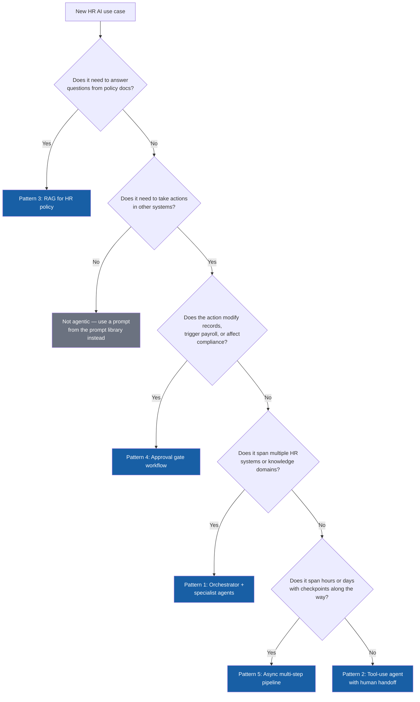

# Agentic HR workflow patterns

A reference guide for designing and deploying AI agents in People Team operations. Each pattern includes an architecture diagram, when to use it, implementation notes, and the governance requirements that apply.

These are not theoretical, they are the patterns that appear repeatedly in production HR agent deployments.

---

## What makes a workflow "agentic"

A workflow is agentic when the AI takes multiple steps autonomously to complete a task, using tools and making decisions along the way, rather than simply responding to a single prompt.

```
Non-agentic:  User prompt → LLM response → done

Agentic:      User prompt → LLM plans → tool call → observe result
                         → LLM reasons → tool call → observe result
                         → LLM reasons → final response → done
```

The key differences from standard AI use:
- The model calls external tools (APIs, databases, calendars, HRIS)
- The model decides what to do next based on what it observes
- Multiple steps happen before the user sees a result
- Failures at any step need handling

---

## Which pattern do I need?

Start here. This decision flow routes you to the right pattern based on what your use case actually needs — match complexity to demonstrated value, not to what's most interesting to build.



Every path through this flow still requires the [human-in-the-loop design](#human-in-the-loop-design) and [failure mode](#failure-modes-to-design-for) sections below — the pattern determines the architecture, not whether governance applies.

---

## Pattern 1: Orchestrator + specialist agents

The most common pattern for complex HR workflows. A coordinator agent receives the user's request, breaks it into sub-tasks, and routes each to a specialist agent.

```
                    ┌─────────────────────┐
                    │   Orchestrator       │
                    │   (coordinator)      │
                    │                     │
                    │ • Parses intent      │
                    │ • Plans sub-tasks    │
                    │ • Routes to agents   │
                    │ • Assembles result   │
                    └──────────┬──────────┘
                               │
          ┌────────────────────┼────────────────────┐
          │                    │                    │
          ▼                    ▼                    ▼
┌─────────────────┐  ┌─────────────────┐  ┌─────────────────┐
│  Policy agent   │  │  HRIS agent     │  │  Calendar agent │
│                 │  │                 │  │                 │
│ • Reads policy  │  │ • Queries       │  │ • Checks avail  │
│   docs          │  │   Workday/SAP   │  │ • Books meetings│
│ • Answers Q&A   │  │ • Updates       │  │ • Sends invites │
│ • Cites source  │  │   records       │  │                 │
└─────────────────┘  └─────────────────┘  └─────────────────┘
```

**When to use:** Tasks that span multiple HR systems or require different types of knowledge. New hire onboarding is the canonical example, it touches policy, HRIS provisioning, and calendar scheduling simultaneously.

**Example:** Employee asks "I'm starting parental leave next month, what do I need to do?" The orchestrator routes to the policy agent (what's the process?), the HRIS agent (what's the employee's current leave balance?), and the calendar agent (when should the manager handoff meeting be scheduled?). The orchestrator assembles a personalized action plan.

**Governance requirement:** The orchestrator must log every sub-task and its result. If any specialist agent fails or returns low-confidence output, the orchestrator must route to a human rather than proceeding.

---

## Pattern 2: Tool-use agent with human handoff

A single agent with access to a defined set of tools. Handles routine tasks autonomously and escalates to a human when it hits defined boundaries.

```
User request
     │
     ▼
┌────────────────────────────────────────┐
│              HR agent                  │
│                                        │
│  Tools available:                      │
│  • search_policy_docs(query)           │
│  • lookup_employee(id)                 │
│  • check_leave_balance(employee_id)    │
│  • create_hr_ticket(details)           │
│  • send_message(recipient, content)    │
│                                        │
│  Escalation triggers:                  │
│  • Confidence below threshold          │
│  • Sensitive topic detected            │
│  • Employee requests human             │
│  • Action requires approval            │
└───────────────┬────────────────────────┘
                │
       ┌────────┴────────┐
       │                 │
       ▼                 ▼
 Resolved by        Escalated to
 agent              human HRBP
 autonomously       (with full
                    context)
```

**When to use:** HR helpdesk, benefits Q&A, leave balance inquiries, high-volume, mostly routine tasks with a clear escalation path.

**Tool design principles:**
- Each tool does one thing and returns structured output
- Tools never take irreversible actions without a confirmation step
- Every tool call is logged with inputs, outputs, and timestamp
- Tools fail gracefully and return an error the agent can reason about

**Escalation design:** Define escalation triggers explicitly in the system prompt, not as an afterthought. The agent should pass the full conversation context to the human so they don't start from scratch.

**Governance requirement:** Monthly audit of escalation rate by topic. If the agent is escalating >30% of a particular query type, the tool or prompt for that topic needs improvement. If it's escalating <5%, check whether it's handling edge cases it should be escalating.

---

## Pattern 3: Retrieval-augmented generation (RAG) for HR policy

Grounds agent responses in authoritative HR documents rather than the model's training data. Eliminates hallucinated policy details.

```
User query: "How many days of bereavement leave do I get?"
     │
     ▼
┌─────────────────────────────┐
│      Query processing       │
│  • Embed query as vector    │
│  • Search policy doc store  │
│  • Retrieve top-k chunks    │
└──────────────┬──────────────┘
               │
               ▼
┌─────────────────────────────┐        ┌──────────────────────┐
│    Context assembly         │◄───────│   Policy doc store   │
│  • Relevant policy chunks   │        │                      │
│  • Employee jurisdiction    │        │  • Employee handbook │
│  • Date (policy currency)   │        │  • Leave policy v3.2 │
└──────────────┬──────────────┘        │  • State addenda     │
               │                       │  • Benefits guide    │
               ▼                       └──────────────────────┘
┌─────────────────────────────┐
│         LLM                 │
│  • Answer grounded in docs  │
│  • Cite source + version    │
│  • Flag if policy unclear   │
└─────────────────────────────┘
```

**When to use:** Any agent that answers policy questions. RAG should be the default for HR Q&A, not optional.

**Implementation notes:**
- Chunk policy documents by section, not by character count
- Store document version and effective date as metadata on every chunk
- Retrieve by jurisdiction where policies vary by state/country
- Always return the source document name and section in the response
- Refresh the document store every time policy is updated, stale RAG is worse than no RAG

**Governance requirement:** Policy document store must have a designated owner responsible for keeping it current. Agent responses should include the policy version they're based on so employees can verify.

---

## Pattern 4: Approval gate workflow

For actions that require human sign-off before execution. The agent prepares everything and waits for approval rather than proceeding autonomously.

```
Employee request: "Please update my emergency contact"
         │
         ▼
┌─────────────────────┐
│   Agent prepares    │
│   • Validates input │
│   • Formats update  │
│   • Checks policy   │
└──────────┬──────────┘
           │
           ▼
┌─────────────────────┐
│   Approval request  │
│   sent to HRBP      │◄──── Agent pauses here
│   with full context │
└──────────┬──────────┘
           │
    ┌──────┴──────┐
    │             │
    ▼             ▼
 Approved      Rejected
    │             │
    ▼             ▼
Agent         Agent notifies
executes      employee with
update        reason
```

**When to use:** Any action that modifies employee records, triggers a payroll change, or has compliance implications. The agent does the work of preparing and validating, the human does the work of deciding.

**Key design principle:** The approval request must give the approver everything they need to decide in one view. Never make an approver go look something up, the agent should have already done that.

---

## Pattern 5: Async multi-step pipeline

For workflows that span hours or days, where the agent picks up where it left off as new information arrives.

```
Day 1: Offer accepted
  └─► Agent creates onboarding record
  └─► Sends IT provisioning request
  └─► Schedules day-1 manager meeting
  └─► Sets reminder: T-5 days check-in
            │
            │ (5 days pass)
            ▼
Day -5: Agent resumes
  └─► Checks IT provisioning status
  └─► If delayed: escalates to IT manager
  └─► Sends new hire pre-boarding checklist
  └─► Sets reminder: T-1 day check-in
            │
            │ (4 more days pass)
            ▼
Day -1: Agent resumes
  └─► Confirms all systems provisioned
  └─► Sends manager day-1 prep guide
  └─► Sends new hire welcome message
```

**When to use:** Onboarding, offboarding, leave management, performance cycles, any multi-day HR process with defined checkpoints.

**Implementation notes:**
- State must be persisted between runs (database or workflow engine, not in-memory)
- Each step should be idempotent, safe to re-run if something fails
- Every resume point needs a freshness check: has anything changed since last run?
- Define what happens if the pipeline stalls (manager change, role change, leave)

**Governance requirement:** Pipeline state and all agent actions must be logged and auditable. HR leadership must be able to reconstruct what the agent did and when for any employee.

---

## Human-in-the-loop design

Every agentic HR workflow needs explicit human touchpoints. This is not optional, it's a legal and ethical requirement for employment-related decisions.

### Mandatory human gates

| Situation | Human role | Agent role |
|---|---|---|
| Employment decision (hire, fire, promote, PIP) | Decides | Prepares and informs |
| Sensitive employee data access | Authorizes | Requests and logs |
| Policy exception | Approves | Identifies and routes |
| Employee requests human | Responds | Hands off with context |
| Agent confidence below threshold | Reviews | Flags and waits |
| Irreversible action (payroll change, termination) | Confirms | Prepares and presents |

### Designing good handoffs

A good handoff from agent to human includes:
1. What the employee asked or what triggered the workflow
2. What the agent did and found
3. What the agent cannot resolve and why
4. What action the human needs to take
5. A direct link to take that action

A bad handoff says "escalated to HR" and makes the HRBP start over.

---

## Failure modes to design for

| Failure | Detection | Response |
|---|---|---|
| Tool returns no results | Check response before proceeding | Acknowledge gap, offer alternative |
| Tool returns stale data | Check data timestamp | Flag currency, recommend verification |
| Model hallucinates policy detail | RAG grounding + citation requirement | Cite source or don't answer |
| Employee asks out of scope | Intent classification | Decline gracefully, route correctly |
| Approval timeout | Set SLA on approval requests | Escalate to manager's manager after X days |
| Loop detection | Count iterations | Break after N steps, escalate |

---

## Getting started

The simplest agentic HR workflow to build first is the **policy Q&A agent** using Pattern 3 (RAG). It has:
- Clear inputs and outputs
- No write access to any system (low risk)
- Easily measurable quality (did it answer correctly?)
- Immediate employee value

From there, add tool use (Pattern 2) to handle follow-up actions like creating helpdesk tickets. Only then introduce orchestration (Pattern 1) for multi-system workflows.

Complexity should be earned by demonstrated value at each prior stage.
