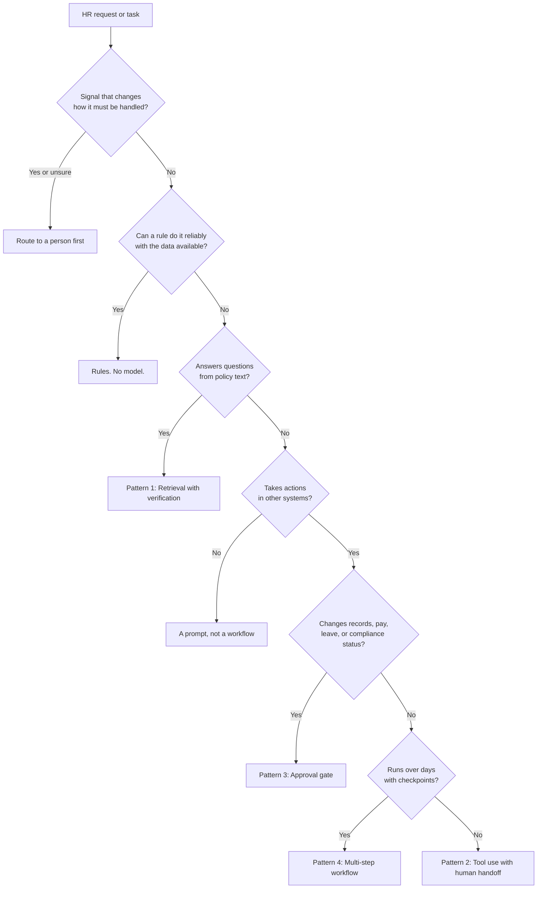

# Workflow patterns for HR AI

> **07 / BUILD** · Match autonomy to evidence and risk. Earn complexity.

[← Roadmap](../06-roadmap/README.md) · [Playbook home](../README.md) · [Next: ROI measurement →](../08-roi-measurement/README.md)

---

**For:** HR technology and engineering teams. **Start with:** [Before choosing a pattern](#before-choosing-a-pattern).

Once a use case is chosen, this section covers how the workflow is put together: where rules do the work, where a model takes part, and where people decide. Each pattern states what this repository demonstrates and what it does not.

Related pages: [scoping an HR AI system](agent-design.md), [testing and evaluation](testing-and-evaluation.md), and [performance data in talent systems](talent-operating-system-architecture.md).

## Before choosing a pattern

Two questions come first. They come from the [decision sequence](../01-use-cases/work-redesign-people-partner.md#decision-sequence) in the People Partner work redesign.

1. **Could the request contain a signal that changes how it must be handled?** Health, accommodation, a workplace concern, safety, or legal action. If yes or uncertain, route it to a person before any automation.
2. **Can a deterministic rule do the task reliably, given the quality of the data?** If yes, use the rule. No model.

```mermaid
flowchart TD
    A[HR request or task] --> B{Signal that changes<br/>how it must be handled?}
    B -- Yes or unsure --> C[Route to a person first]
    B -- No --> D{Can a rule do it reliably<br/>with the data available?}
    D -- Yes --> E[Rules. No model.]
    D -- No --> F{Answers questions<br/>from policy text?}
    F -- Yes --> G[Pattern 1: Retrieval with verification]
    F -- No --> H{Takes actions<br/>in other systems?}
    H -- No --> I[A prompt, not a workflow]
    H -- Yes --> J{Changes records, pay,<br/>leave, or compliance status?}
    J -- Yes --> K[Pattern 3: Approval gate]
    J -- No --> L{Runs over days<br/>with checkpoints?}
    L -- Yes --> M[Pattern 4: Multi-step workflow]
    L -- No --> N[Pattern 2: Tool use with human handoff]
```

Every path still needs the [human decision points](#human-decision-points) and [failure modes](#failure-modes) below.

## Pattern 1: Retrieval with verification

Answers policy questions from the organization's own documents.

- **Use when** employees ask what a policy says.
- **Key controls.** Select policies by metadata (jurisdiction, population, effective date, superseded status, policy type) wherever it exists; retrieval by similarity alone can surface an outdated document that reads well. Cite the source and version. If no policy applies, escalate. Retrieved text is data, not instructions. Retrieval reduces unsupported answers; it does not eliminate them.
- **In this repository.** The [policy Q&A tool](../10-mcp-agents/policy_qa/ENABLEMENT.md) retrieves and cites governance sections by lexical search, with no model; its citations and disclaimer are tested. [Resolve](https://github.com/ellehelvig/peopleops-resolution-agent) selects policies by version and region with rules, tested. Model-written answers are not demonstrated.

## Pattern 2: Tool use with human handoff

A model calls a few narrow tools and hands off at defined boundaries.

- **Use when** requests are bounded and the escalation path is clear.
- **Key controls.** Few tools, each doing one thing with structured output. No tool takes an irreversible action or records a human decision. Hand off on defined triggers: a signal that changes handling, a request outside scope, an employee asking for a person, any action that needs approval, or model output outside the allowed values. Language models do not produce calibrated confidence, so "confidence below a threshold" is not a reliable trigger. Pass the full context to the person.
- **In this repository.** Resolve's MCP server exposes three tools with no approval tool, and `create_case` accepts only request text; both are tested. The playbook's [MCP server](../10-mcp-agents/README.md) exposes six deterministic tools; `human_review_required` is tested in three of its four packages. A model calling these tools is not demonstrated.

## Pattern 3: Approval gate

Prepares a consequential action and waits for the accountable role.

- **Use when** the action changes records, pay, leave, work location, reporting lines, or compliance status.
- **Key controls.** The accountable role is set per decision type. The approver sees source evidence, with anything a model wrote labeled apart from source facts. A decision is recorded once, on a pending case, with who decided and why. The system cannot approve its own recommendation. Pending approvals expire; nothing is approved by default.
- **In this repository.** Resolve sets the approver per decision type and enforces the gate, tested. Authenticated reviewer identity and labeling of model-written text are proposed.

## Pattern 4: Multi-step workflow with checkpoints

Carries a process such as onboarding over days, resuming at defined points.

- **Use when** a process spans days and several systems.
- **Key controls.** State is stored durably, not in memory. Each step is safe to re-run. At each checkpoint, check what changed (role, manager, leave status). A stalled workflow goes to a person. Every action is logged.
- **In this repository.** Not demonstrated.

## Not included: coordinating agents

An orchestrator dispatching work to several agents adds failure points and makes accountability harder to trace. Nothing in this repository demonstrates it. Consider it only after simpler patterns have evidence and a single workflow cannot do the job.

## Human decision points

A playbook design standard; applicable law varies by jurisdiction (see [governance](../03-governance/README.md)).

| Situation | Person | System |
|---|---|---|
| Employment decision: hire, promote, performance plan, termination | Decides | Prepares |
| Access to sensitive employee data | Authorizes | Requests and logs |
| Policy exception | Approves | Identifies and routes |
| Employee asks for a person | Responds | Hands off with context |
| Signal that changes handling, or output outside allowed values | Reviews | Routes and waits |
| Irreversible action, such as a payroll change | Confirms | Prepares |

A good handoff says what was asked, what the system did and found, what it could not resolve and why, and what the person needs to do, with a direct link to do it.

## Failure modes

| Failure | Detection | Response |
|---|---|---|
| A request looks routine but is not | Layered screening; sampled review of non-escalated requests | Route to the right specialist; add a new kind of test case |
| Tool returns nothing | Check before proceeding | Say so; offer a person |
| Tool returns stale data | Check the data's date | Flag it; recommend verification |
| Answer not supported by the source | Citation required and sampled against the source | Cite or do not answer |
| Text in a request tries to change the system's behavior | Structural limits: narrow tools, allowlisted data, no self-approval | Log as a security event |
| Approval not given in time | Deadline on each approval | Escalate; never approve by default |
| Loop or stall | Step limit | Stop and escalate |

## Where to start

Start with Pattern 1 on well-governed policy data, from the [policy Q&A tool](../10-mcp-agents/policy_qa/ENABLEMENT.md). Add Pattern 2 only after Pattern 1 has evidence, and Pattern 3 wherever an action is consequential. Complexity should be earned by demonstrated value at each prior stage.
