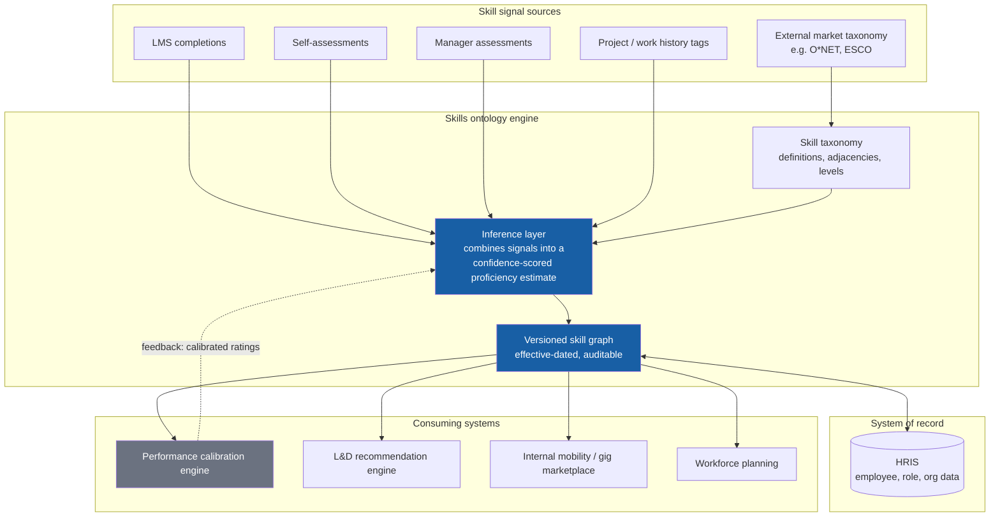
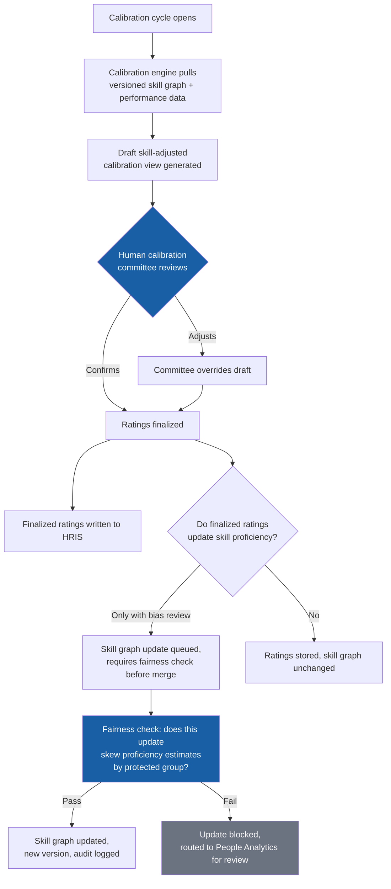

# Talent operating system architecture: skills ontology, HRIS, and performance calibration

A systems architecture reference for teams wiring a dynamic skills ontology into their core HRIS and performance calibration process. This is not an agent pattern like the five above, it's the data layer those agents should be built on. A policy Q&A agent or an orchestrator can be bolted onto whatever system of record you have today. A skills-driven talent operating system can't, because the ontology has to sit between multiple systems and stay current, or everything built on top of it (L&D recommendations, internal mobility, workforce planning) inherits stale or inconsistent skill data.

---

## Why a skills ontology needs its own architecture layer

Most HRIS platforms have a "skills" field. Very few have a skills *ontology*, a versioned, defined taxonomy with proficiency levels, adjacency relationships (which skills are near-substitutes, which build on which), and a clear inference method for how a skill signal turns into a proficiency estimate on an employee's profile.

Without that layer, three failure modes show up repeatedly:

1. **Skill data fragments across systems.** The LMS has one taxonomy, the ATS has another, the performance system has free-text skill tags. Nothing reconciles them, so "Python" in one system and "Python programming" in another are treated as unrelated.
2. **Skill proficiency silently becomes performance rating.** Without an explicit inference layer, the easiest signal to use is the most recent performance rating, which means skill data inherits whatever bias, recency effect, or manager-to-manager inconsistency already exists in performance ratings. See the [fairness check](#fairness-check-before-any-skill-graph-update) built into the calibration flow below, this is the single most important governance control in this document.
3. **Nobody owns it.** IT owns the HRIS. L&D owns the LMS. Talent Acquisition owns the ATS. A skills ontology that spans all three needs an explicit owner, usually Talent or People Analytics, or it degrades into whichever system's taxonomy was easiest to export last.

---

## System architecture

**Read this diagram right to left in intent, left to right in data flow.** The consuming systems (calibration, L&D, mobility, workforce planning) are why the ontology exists. The signal sources on the left are inputs, none of them individually authoritative. The inference layer's job is to combine them into a single confidence-scored estimate per skill, per employee, and the versioned skill graph is what everything downstream actually reads from, never the raw signals directly.

**The HRIS relationship is bidirectional, not one-way.** The HRIS supplies role, org, and employment data the ontology needs for context (which competency framework applies to this employee's role). The ontology supplies skill data back to the HRIS so it shows up in the employee's core record. Neither system should silently overwrite the other; define which system wins on which fields before you build this.

---

## Calibration cycle: where the fairness risk actually lives

The highest-risk moment in this architecture is the feedback loop from performance calibration back into the skill graph. It's also the most useful moment, calibrated performance data is a strong skill signal, which is exactly why it needs a control most teams skip.

### Fairness check before any skill graph update

Performance ratings are not a neutral skill signal, they carry whatever manager-to-manager inconsistency, recency bias, or disparate treatment already exists in your performance process. Feeding calibrated ratings straight into skill proficiency estimates launders that bias into a system that then drives L&D investment, internal mobility recommendations, and workforce planning, decisions with their own downstream consequences for the same employees.

This is the same fairness-audit non-negotiable that applies everywhere else in this playbook, applied to a system most teams don't think of as "scoring" employees because it's framed as skills infrastructure, not a rating. It is still scoring employees. Treat any skill-graph update sourced from performance data as a use case requiring the [risk assessment template](../03-governance/risk-assessment-template.md), not as routine system sync.

---

## Design principles

**HRIS-agnostic by construction.** Build the ontology and inference layer as a system that sits beside the HRIS, connected through an adapter, not as a module inside one vendor's platform. Vendors change; a skills ontology tightly coupled to one HRIS has to be rebuilt at the next platform migration. See the [build vs. buy framework](../03-governance/vendor-selection-framework.md) for the same build/buy discipline applied here, most teams should buy the taxonomy and adapters, and reserve build effort for the inference logic and governance gates that are specific to their organization.

**Version everything, effective-dated.** A skill graph without version history can't answer "what did we think this person's skill level was six months ago, and why did it change." That question comes up in performance disputes, promotion cases, and audits. Treat every skill graph update like an event, not an overwrite.

**Confidence scores, not false precision.** A proficiency estimate inferred from a single self-assessment is not the same quality of signal as one corroborated by LMS completion, manager assessment, and project history. Surface the confidence level to anything consuming the data, an L&D recommendation built on a low-confidence estimate should say so.

**One taxonomy owner, explicitly named.** Usually Talent or People Analytics, not IT and not whichever function exported first. The owner is accountable for taxonomy currency, adjacency accuracy, and resolving conflicts when two source systems disagree about a skill definition.

**Never let the ontology decide, only inform.** Same principle as everywhere else in this playbook: internal mobility and workforce planning recommendations that draw on this system are recommendations. A human makes the placement, promotion, or investment decision.

---

## Failure modes to design for

| Failure | Detection | Response |
|---|---|---|
| Two source systems disagree on a skill definition or level | Taxonomy conflict rule in the inference layer | Route to taxonomy owner, do not silently pick one |
| Skill graph update sourced entirely from performance ratings | Fairness check gate (above) | Block merge, route to People Analytics |
| Consuming system reads stale skill graph version | Version pinning check on read | Force refresh or flag staleness to the consuming system |
| Low-confidence estimate treated as certain by a downstream system | Confidence threshold check | Suppress or flag low-confidence recommendations |
| HRIS and skill graph disagree on a field both claim to own | Field-ownership conflict rule | Defined field-ownership map resolves automatically; undefined conflicts escalate to the taxonomy owner |

---

## Getting started

Build the taxonomy and inference layer against one function first, engineering is a common starting point because skill signals (code review, project tags, certifications) are relatively clean. Wire in one consuming system, typically L&D recommendations, before connecting the calibration feedback loop. The fairness check gate above is not optional once that feedback loop is live, build it before the first calibration cycle runs through the system, not after.

---

## Cross-links

- [Agentic HR workflow patterns](README.md): the agent patterns that should be built on top of this data layer, not instead of it.
- [Designing HR agents](agent-design.md): the blueprint for any agent that consumes skill graph data (an internal mobility matching agent, for example).
- [Skills gap analysis notebook](../05-notebooks/skills-gap-analysis.ipynb): a working example of the competency-framework-to-gap-score logic this architecture generalizes into a live system.
- [Build vs. buy and vendor selection framework](../03-governance/vendor-selection-framework.md): the decision framework for which parts of this to buy.
- [Risk assessment template](../03-governance/risk-assessment-template.md): required before any skill-graph update sourced from performance data goes live.
