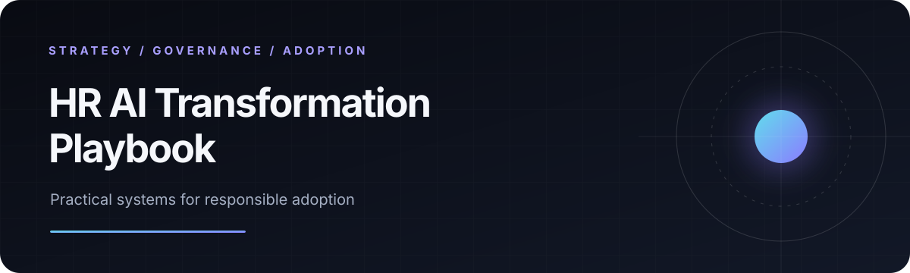
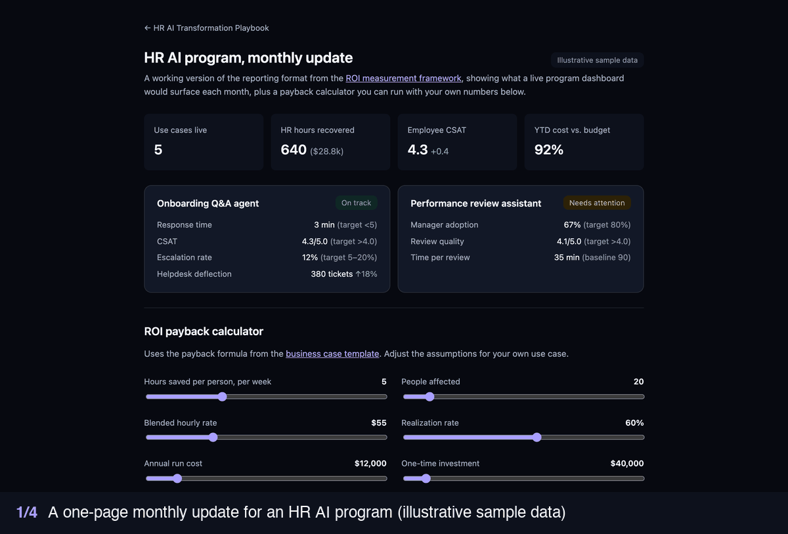

  

  How a People team moves from scattered AI experiments to responsible, measurable adoption.

  
  
  

  

---

## The point of view

Most HR AI programs stall in one of three places: they start with the wrong use case, they cannot get through Legal and Privacy, or nobody changes how they work. This playbook takes a position on each.

1. **Start with the decision, not the tool.** Score every idea on value, risk, and readiness before anyone buys anything.
2. **Governance is a design input, not a gate at the end.** Legal, Privacy, and employee representatives see the intake before the build starts.
3. **Humans make consequential employment decisions.** AI can inform hiring, pay, and performance decisions. It never makes them. The tools here return evidence flagged for human review, never a decision, and [Resolve](https://github.com/ellehelvig/peopleops-resolution-agent) enforces a human approval step in code.
4. **Measure changed work, not launched tools.** A tool nobody trusts is a cost. Training and measurement are planned from day one.

## See it in five minutes

| Time | Look at | What it shows |
|---|---|---|
| 1 minute | [ROI calculator](https://ellehelvig.github.io/hr-ai-transformation-playbook/08-roi-measurement/dashboard.html) | A payback model a CFO can run with their own numbers |
| 2 minutes | [Prioritization matrix](01-use-cases/prioritization-matrix.md) | How to pick the first three use cases, with a worked example |
| 2 minutes | [Resume screening tool](10-mcp-agents/resume_screen/ENABLEMENT.md) | A deterministic tool an AI assistant can call. It shows the evidence for each job requirement, returns no fitness score, never compares candidates, and lists what its design cannot prevent |

## How it fits together

| Stage | The question it answers | Sections |
|---|---|---|
| **Decide** | What should we build first, and in what order? | [01 · Use cases](01-use-cases/README.md): 37 vetted HR AI use cases and a prioritization matrix [06 · Roadmap](06-roadmap/README.md): an 18-month plan with phase gates |
| **Govern** | Can we deploy this responsibly? | [03 · Governance](03-governance/README.md): AI use policy, risk assessment, EU AI Act intake, vendor review, incident response, and [key legal dates](03-governance/README.md#key-dates-for-hr) |
| **Build** | How do we make it work, safely? | [02 · Prompts](02-prompt-library/README.md) for eight HR functions [11 · Skills](11-skills/README.md): six installable agent skills [07 · Workflow patterns](07-agentic-patterns/README.md): four architecture patterns [10 · MCP tools](10-mcp-agents/README.md), [09 · Evals](09-evals/README.md), [05 · Notebooks](05-notebooks/README.md) |
| **Adopt and prove** | Will people use it, and is it worth it? | [04 · Enablement](04-enablement/README.md): a 4-module literacy curriculum and a 90-day adoption plan [08 · ROI](08-roi-measurement/README.md): business case, metrics, and reporting |

**New here?** HR leaders start with [Decide](01-use-cases/README.md). Legal and Privacy partners start with the [AI use policy](03-governance/ai-use-policy.md). Engineers start with the [MCP tools](10-mcp-agents/README.md).

## What this demonstrates

Built by Elle Helvig, an HR transformation leader. I defined the HR problems, designed the operating model and governance approach, and built the tools with AI-assisted development. The work shows four things a People AI program needs from one leader:

- **Strategy.** Turning a long list of AI ideas into a sequenced, fundable roadmap.
- **Governance.** Translating the EU AI Act, GDPR, and US state and city laws into templates HR teams can actually fill in.
- **Hands-on building.** Working tools, agent skills, and evaluations, not slideware.
- **Adoption.** Training, change management, and the metrics that show whether it worked.

## For technical reviewers

- Three notebooks execute in CI on every push, using synthetic data only.
- Four HR workflows expose six MCP tools, backed by a 52-test suite. No tool calls an LLM internally, so their behavior is reproducible and auditable.
- The comp banding, resume screening, and recruiter intake tools always return `human_review_required: true`, with no code path that turns it off, and their tests check it. The policy Q&A tool instead always returns a not-legal-advice disclaimer, also tested.
- The 29-case eval runner exits non-zero when a refusal, escalation, or empty-response gate fails, so it can block a launch. Its scorer and LLM judge have 39 tests of their own, and the runner can measure the judge's agreement with human labels (Cohen's kappa). No labeled run has been done yet, so judge verdicts are not a launch gate.
- Nothing assumes a specific HRIS, ATS, or model provider.

## Scope and limits

Covers the EU, the US (federal, New York City, and several states), the UK, and Ontario. Not APAC, Latin America, the Middle East, or Africa. Legal dates are reviewed by hand each quarter in the [Key dates for HR](03-governance/README.md#key-dates-for-hr) table. None of this is legal advice; have Legal and Privacy review any document before you adopt it. All data is synthetic.

---

MIT licensed. [Contributing](CONTRIBUTING.md) · [Changelog](CHANGELOG.md) · [Cite this work](CITATION.cff) · [Elle Helvig on LinkedIn](https://www.linkedin.com/in/ellehelvig/)
